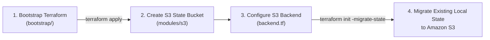

# Dating Backend Infrastructure (`dating-backend-infra`)

Repository ini berisi konfigurasi **Infrastructure as Code (IaC)** menggunakan **Terraform** untuk melakukan provisioning, konfigurasi, dan pengelolaan seluruh infrastruktur cloud **AWS** yang digunakan oleh aplikasi **Dating Backend** (`dating-backend`) pada region `ap-southeast-1` (Singapura).

Seluruh resource dikelola secara deklaratif dan modular dengan Terraform, mencakup networking (VPC, Subnet, Internet Gateway, Route Table), compute (EC2 Instance), container registry (Amazon ECR), identity and access management (IAM Role, Instance Profile, GitHub Actions OIDC), security group firewall, serta dedicated S3 Bucket untuk Terraform Remote State storage.

---

## Daftar Isi
1. [Arsitektur & Komponen Infrastruktur](#1-arsitektur--komponen-infrastruktur)
2. [Refactoring Root Configuration Terraform](#2-refactoring-root-configuration-terraform)
3. [Terraform Remote State & S3 Backend](#3-terraform-remote-state--s3-backend)
4. [Modul S3 Terraform State](#4-modul-s3-terraform-state)
5. [Bootstrap Terraform Configuration](#5-bootstrap-terraform-configuration)
6. [Migrasi Terraform State](#6-migrasi-terraform-state)
7. [EC2 Configuration: AMI Pinning, IAM Profile & IMDSv2](#7-ec2-configuration-ami-pinning-iam-profile--imdsv2)
8. [Struktur Repository](#8-struktur-repository)
9. [Verifikasi & Validasi Infrastruktur](#9-verifikasi--validasi-infrastruktur)
10. [Git & Secret Security](#10-git--secret-security)
11. [Panduan Penggunaan](#11-panduan-penggunaan)

---

## 1. Arsitektur & Komponen Infrastruktur

Infrastruktur dibangun di AWS region `ap-southeast-1` dengan komponen utama sebagai berikut:

| Komponen | AWS Resource | Deskripsi & Peran |
| :--- | :--- | :--- |
| **VPC** | `aws_vpc` | Virtual Private Cloud khusus dengan CIDR block terisolasi (`10.0.0.0/16`) serta DNS support dan hostnames aktif. |
| **Public Subnet** | `aws_subnet` | Subnet publik pada satu Availability Zone (`ap-southeast-1a`) dengan public IP auto-assignment (`10.0.1.0/24`). |
| **Internet Gateway** | `aws_internet_gateway` | Gateway penghubung antara VPC dengan internet publik. |
| **Route Table** | `aws_route_table` & `association` | Routing tabel publik yang mengarahkan default traffic (`0.0.0.0/0`) ke Internet Gateway. |
| **Security Group** | `aws_security_group` | Firewall stateful tingkat instance: mengizinkan ingress HTTP (port 80) dan HTTPS (port 443) dari `0.0.0.0/0`, SSH (port 22) terbatas ke IP administrator, serta seluruh outbound traffic. |
| **IAM & OIDC** | `aws_iam_role`, `policy`, `instance_profile` | EC2 IAM Role dengan policy ECR Read Only dan SSM Managed Instance Core, IAM Instance Profile, serta GitHub Actions OIDC deploy role terintegrasi federasi web identity. |
| **Compute** | `aws_instance` (EC2) | Instance tipe `t3.micro` menjalankan Amazon Linux 2023, Docker runtime, user-data bootstrap, IAM instance profile, dan IMDSv2 enforced. |
| **Registry** | `aws_ecr_repository` & `lifecycle` | Private Docker container registry dengan immutable image tag, automated vulnerability scanning on push, dan lifecycle policy menyimpan 10 image terbaru. |
| **Remote State** | `aws_s3_bucket` & konfigurasi terkait | Dedicated S3 bucket untuk penyimpanan Terraform Remote State dengan enkripsi SSE-AES256, versioning, dan locking. |

---

## 2. Refactoring Root Configuration Terraform

Sebelumnya, seluruh pemanggilan module call berada di dalam satu file monolithic `main.tf`.

Konfigurasi root directory telah direfaktor dengan menghapus `main.tf` dan memisahkan setiap pemanggilan module ke dalam file deklarasi tersendiri berdasarkan domain resource:
- `vpc.tf` — memanggil `module.vpc`
- `subnet.tf` — memanggil `module.subnet`
- `internet_gateway.tf` — memanggil `module.internet_gateway`
- `route_table.tf` — memanggil `module.route_table`
- `security_group.tf` — memanggil `module.security_group`
- `iam.tf` — memanggil `module.iam`
- `ec2.tf` — memanggil `module.ec2`
- `ecr.tf` — memanggil `module.ecr`

> [!NOTE]
> Terraform secara native memproses dan menggabungkan seluruh file berkestensi `.tf` di dalam root directory sebagai satu kesatuan **root module**. Pemisahan file ini murni perubahan struktural untuk meningkatkan modularitas, keterbacaan (*readability*), dan kemudahan pemeliharaan (*maintainability*) tanpa mengubah cara kerja maupun resource graph Terraform.

---

## 3. Terraform Remote State & S3 Backend

Terraform State kini dikelola secara terpusat menggunakan **Amazon S3 Backend**. Konfigurasi remote backend dideklarasikan pada file `backend.tf`:

```hcl
terraform {
  backend "s3" {
    bucket       = "dating-backend-terraform-state-992382472679"
    key          = "dating-backend/terraform.tfstate"
    region       = "ap-southeast-1"
    encrypt      = true
    use_lockfile = true
  }
}
```

Rincian konfigurasi S3 Backend:
- **S3 Bucket**: `dating-backend-terraform-state-992382472679`
- **Key**: `dating-backend/terraform.tfstate`
- **Region**: `ap-southeast-1`
- **Encryption**: `encrypt = true` (server-side encryption menggunakan AES256)
- **Locking**: `use_lockfile = true`

### Tujuan Remote State dan State Locking
1. **Penyimpanan Terpusat & Kolaboratif**: Terraform State tidak lagi tersimpan secara lokal pada komputer individual pengembang. Penyimpanan terpusat pada S3 memastikan seluruh operasi infrastruktur (baik via CLI lokal maupun runner otomasi) selalu menggunakan *single source of truth* yang sinkron dan up-to-date.
2. **Perlindungan Terhadap Race Condition (State Locking)**: Fitur native S3 state locking (`use_lockfile = true`) memanfaatkan fitur *conditional writes* Amazon S3. Ketika perintah Terraform seperti `plan` atau `apply` sedang berjalan, lockfile dibuat secara otomatis untuk mencegah eksekusi konkuren simultan yang berpotensi merusak (*corrupt*) data state.
3. **Ketahanan Data & Disaster Recovery**: State file terhindar dari risiko kehilangan akibat kegagalan storage lokal mesin pengembang.

---

## 4. Modul S3 Terraform State

Pembuatan S3 bucket untuk remote state dikelola secara deklaratif melalui module terpisah:
`modules/s3/`

Module ini mengonfigurasi bucket S3 dengan standar keamanan tinggi:
- **S3 Bucket** (`aws_s3_bucket`): Bucket khusus untuk menyimpan file state dengan penamaan terstandarisasi.
- **Versioning Enabled** (`aws_s3_bucket_versioning`): `status = "Enabled"`. Setiap versi perubahan state disimpan secara historis. Jika terjadi kesalahan atau kerusakan pada state file, versi sebelumnya dapat di-restore dengan aman.
- **Server-Side Encryption AES256** (`aws_s3_bucket_server_side_encryption_configuration`): Mengamankan seluruh data state *at rest* secara otomatis menggunakan enkripsi standar `AES256` (SSE-S3).
- **Public Access Block Enabled** (`aws_s3_bucket_public_access_block`): Seluruh opsi pemblokiran akses publik diaktifkan (`block_public_acls = true`, `block_public_policy = true`, `ignore_public_acls = true`, `restrict_public_buckets = true`) untuk menjamin state bucket tidak dapat diakses dari internet publik dalam kondisi apa pun.
- **Object Ownership `BucketOwnerEnforced`** (`aws_s3_bucket_ownership_controls`): Menonaktifkan Access Control List (ACL) pada S3 bucket dan memastikan kepemilikan mutlak seluruh objek berada di bawah akun pemilik bucket.
- **Deletion Protection** (`force_destroy = false`): Mencegah penghapusan bucket secara tidak sengaja melalui Terraform apabila bucket masih berisi objek atau riwayat versioning state.

---

## 5. Bootstrap Terraform Configuration

Terdapat direktori terpisah:
`bootstrap/`

Direktori ini adalah konfigurasi Terraform independen yang digunakan untuk membuat S3 bucket remote state sebelum konfigurasi root Terraform diinisialisasi dengan S3 Backend.

Pemisahan ini mengatasi siklus dependensi (*chicken-and-egg problem*): konfigurasi root Terraform membutuhkan S3 bucket yang sudah eksis di AWS untuk backend-nya, sementara S3 bucket itu sendiri dibuat melalui kode Terraform.

### Alur Bootstrap & Setup Backend


1. **Bootstrap Terraform**: Masuk ke direktori `bootstrap/` dan jalankan `terraform init` serta `terraform apply` untuk membuat S3 bucket remote state via `modules/s3`.
2. **Create S3 State Bucket**: S3 bucket terbuat dengan versioning, enkripsi AES256, dan public access block aktif.
3. **Configure S3 Backend**: Deklarasikan blok `backend "s3"` pada `backend.tf` di root directory.
4. **Migrate State**: Jalankan `terraform init -migrate-state` pada root directory untuk memindahkan local state ke S3 remote state.

---

## 6. Migrasi Terraform State

Local Terraform State (`terraform.tfstate` lokal) yang digunakan sebelumnya telah berhasil dimigrasikan sepenuhnya ke Amazon S3 Remote State.

> [!IMPORTANT]
> Seluruh resource AWS eksisting (VPC, Subnet, Route Table, Internet Gateway, Security Group, IAM Role/Profile, EC2 Instance, dan ECR) **tetap dipertahankan dan tidak dibuat ulang**. Proses migrasi state hanya memindahkan pointer dan metadata state dari storage lokal ke remote S3 bucket tanpa memicu modifikasi maupun *recreation* pada cloud resource riil.

---

## 7. EC2 Configuration: AMI Pinning, IAM Profile & IMDSv2

### 1. Explicit AMI ID Pinning
Sebelumnya, konfigurasi EC2 menggunakan AWS SSM public parameter:
`/aws/service/ami-amazon-linux-latest/al2023-ami-kernel-default-x86_64`

Konfigurasi tersebut telah diubah menjadi explicit AMI ID melalui variable:
- Pada `modules/ec2/main.tf`, resource EC2 menggunakan:
  ```hcl
  ami = var.ami_id
  ```
- Pada root `variables.tf`, dideklarasikan:
  ```hcl
  variable "ami_id" {
    description = "AMI ID for the EC2 instance"
    type        = string
    sensitive   = true
  }
  ```
- **Alasan Perubahan**: Penggunaan parameter dinamis SSM `amazon-linux-latest` menyebabkan Terraform membaca nilai AMI terbaru yang dirilis AWS secara berkala. Hal ini berisiko memicu *unintended replacement* (penghapusan dan pembuatan ulang) pada instance EC2 production saat `terraform apply` dijalankan. Dengan melakukan pinning terhadap explicit AMI ID, lifecycle instance menjadi stabil dan terkontrol.
- **AMI Production Aktual**: Instance production saat ini menggunakan AMI ID:
  `ami-0c6b3b583f6e55a2f` (Amazon Linux 2023).

### 2. IAM Instance Profile dari IAM Module
Instance EC2 menggunakan IAM Instance Profile yang dikelola dan di-output oleh module IAM:
- Pada root `ec2.tf`:
  ```hcl
  module "ec2" {
    source = "./modules/ec2"

    project_name          = var.project_name
    ami_id                = var.ami_id
    instance_type         = var.instance_type
    subnet_id             = module.subnet.subnet_id
    security_group_id     = module.security_group.security_group_id
    instance_profile_name = module.iam.instance_profile_name
    key_name              = var.key_name
  }
  ```
- Hubungan dependency ini memastikan EC2 instance profile (`module.iam.instance_profile_name`) secara otomatis terikat pada IAM Role yang memiliki policy:
  - `AmazonEC2ContainerRegistryReadOnly`: Memungkinkan instance melakukan autentikasi dan pull Docker image dari Amazon ECR.
  - `AmazonSSMManagedInstanceCore`: Memungkinkan manajemen remote instance tanpa membuka port SSH melalui AWS Systems Manager (SSM) Run Command.

### 3. Wajib IMDSv2 (Instance Metadata Service Version 2)
Pada `modules/ec2/main.tf`, EC2 dikonfigurasikan dengan blok:
```hcl
metadata_options {
  http_tokens = "required"
}
```
Parameter `http_tokens = "required"` mewajibkan penggunaan token berbasis session (IMDSv2) untuk setiap request ke instance metadata service. Konfigurasi ini menonaktifkan IMDSv1 lama guna memitigasi risiko keamanan seperti serangan Server-Side Request Forgery (SSRF) dan eksfiltrasi kredensial IAM dari dalam host.

---

## 8. Struktur Repository

Struktur direktori dan file pada repository `dating-backend-infra` saat ini:

```text
dating-backend-infra/
├── backend.tf
├── ec2.tf
├── ecr.tf
├── iam.tf
├── internet_gateway.tf
├── outputs.tf
├── providers.tf
├── route_table.tf
├── security_group.tf
├── subnet.tf
├── variables.tf
├── vpc.tf
│
├── bootstrap/
│   └── ...
│
└── modules/
    ├── ec2/
    │   └── ...
    │
    ├── ecr/
    │   └── ...
    │
    ├── iam/
    │   └── ...
    │
    ├── internet_gateway/
    │   └── ...
    │
    ├── route_table/
    │   └── ...
    │
    ├── s3/
    │   └── ...
    │
    ├── security_group/
    │   └── ...
    │
    ├── subnet/
    │   └── ...
    │
    └── vpc/
        └── ...
```

---

## 9. Verifikasi & Validasi Infrastruktur

Kualitas kode Terraform dan sinkronisasi terhadap infrastruktur AWS telah diverifikasi dengan serangkaian pengujian:

```bash
# 1. Pengecekan standarisasi format kode secara rekursif
terraform fmt -check -recursive

# 2. Validasi sintaksis dan integritas seluruh konfigurasi modul
terraform validate

# 3. Pengecekan perbandingan konfigurasi terhadap status riil infrastruktur AWS
terraform plan
```

### Hasil Verifikasi Final
- **`terraform fmt -check -recursive`**: Berhasil tanpa error formatting.
- **`terraform validate`**: Berhasil (`Success! The configuration is valid.`).
- **`terraform plan`**: Menghasilkan status:
  ```text
  No changes. Your infrastructure matches the configuration.
  ```

Hasil tersebut membuktikan bahwa konfigurasi Terraform saat ini sudah cocok (*match*) dengan existing AWS infrastructure tanpa adanya *state drift* atau perubahan yang belum diaplikasikan.

---

## 10. Git & Secret Security

Sesuai dengan file `.gitignore`, file dan direktori sensitif berikut **tidak di-track** oleh Git:
- `terraform.tfvars`: Menyimpan nilai parameter lingkungan lokal, IP administrator, atau ID akun.
- `*.tfstate`: File state lokal Terraform.
- `*.tfstate.*`: File cadangan (*backup*) state lokal Terraform.
- `.terraform/`: Cache lokal Terraform provider plugin dan status backend.
- `crash.log` & `crash.*.log`: Log crash debugging Terraform.

> [!CAUTION]
> Jangan pernah melakukan commit file `terraform.tfvars` atau file `*.tfstate` ke Git repository. Untuk deployment baru, gunakan template `terraform.tfvars.example` sebagai referensi pengisian nilai variabel.

---

## 11. Panduan Penggunaan

### Prasyarat
- Terraform versi `>= 1.5.0`
- AWS CLI terkonfigurasi dengan profil akses IAM yang memiliki hak akses administratif pada AWS account target

### Alur Eksekusi Root Terraform
1. **Salin Template Variabel**:
   ```bash
   cp terraform.tfvars.example terraform.tfvars
   ```
2. **Lengkapi Variabel pada `terraform.tfvars`**:
   Sesuaikan parameter berikut pada `terraform.tfvars`:
   ```hcl
   aws_region         = "ap-southeast-1"
   project_name       = "dating-backend"
   vpc_cidr           = "10.0.0.0/16"
   public_subnet_cidr = "10.0.1.0/24"
   availability_zone  = "ap-southeast-1a"
   instance_type      = "t3.micro"
   ssh_allowed_cidr   = "REPLACE_WITH_YOUR_PUBLIC_IP/32"
   aws_account_id     = "YOUR_AWS_ACCOUNT_ID"
   ami_id             = "ami-0c6b3b583f6e55a2f"
   ```
3. **Inisialisasi Backend & Modul**:
   ```bash
   terraform init
   ```
4. **Validasi & Perencanaan**:
   ```bash
   terraform validate
   terraform plan
   ```
5. **Penerapan Perubahan**:
   ```bash
   terraform apply
   ```

### Outputs Infrastruktur
Setelah konfigurasi diaplikasikan, Terraform mengekspos outputs berikut untuk kebutuhan deployment aplikasi:
- `vpc_id`: ID VPC yang dibuat.
- `subnet_id`: ID Public Subnet.
- `security_group_id`: ID Security Group untuk EC2.
- `ec2_instance_id`: ID instance EC2.
- `ec2_public_ip`: Public IP instance EC2 (digunakan untuk konfigurasi DNS A Record).
- `ecr_repository_url`: URL privat Amazon ECR repository.
